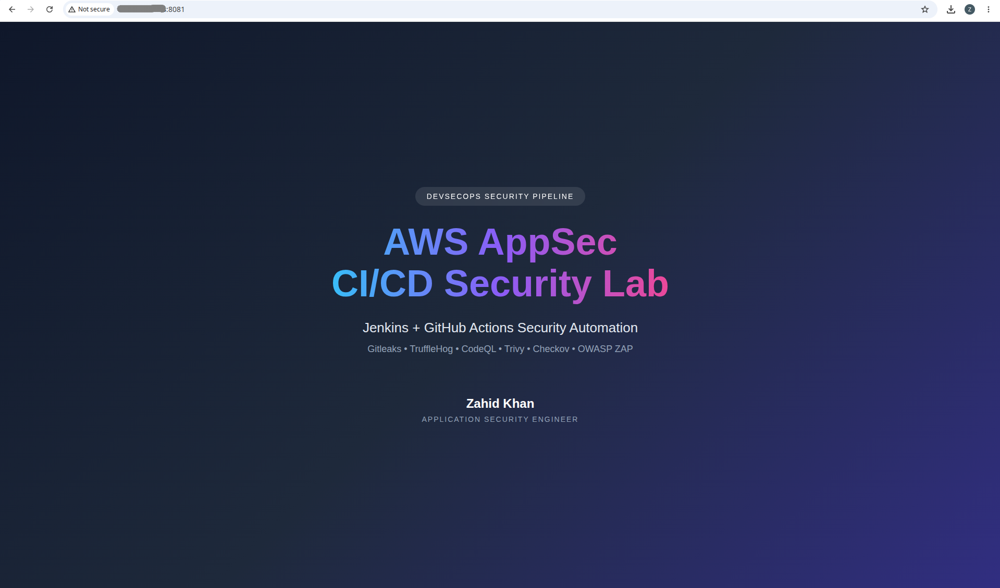

# 🚀 AWS AppSec DevSecOps CI/CD Lab

A hands-on Application Security portfolio project demonstrating a secure CI/CD pipeline using AWS, Jenkins, GitHub Actions, Docker, and open-source security tools.

---

## 📖 Overview

This project demonstrates how security controls can be integrated into CI/CD workflows to support Secure SDLC and DevSecOps practices.

The lab automates:

- Source code checkout
- Secret scanning
- Static Application Security Testing (SAST)
- Vulnerability scanning
- Configuration scanning
- Container security checks
- Docker deployment
- Dynamic Application Security Testing (DAST)
- Security report generation

---

## 🏗️ Architecture

```text
GitHub Repository
        |
        |-- GitHub Actions
        |       |
        |       |-- CodeQL SAST
        |               |
        |               |-- GitHub Code Scanning Alerts
        |
        |-- Jenkins Pipeline
                |
                |-- Gitleaks Secret Scan
                |-- TruffleHog Secret Scan
                |-- Trivy Filesystem Scan
                |-- Checkov Configuration Scan
                |-- Docker Build
                |-- Trivy Image Scan
                |-- Docker Deployment
                |-- OWASP ZAP DAST
```

---

## ☁️ Technology Stack

- AWS EC2
- Jenkins
- GitHub Actions
- Docker
- GitHub
- HTML
- CSS
- JavaScript

---

## 🔒 Security Tools Integrated

| Tool | Category | Purpose |
|---|---|---|
| Gitleaks | Secret Scanning | Detect hardcoded secrets |
| TruffleHog | Secret Scanning | Git history and filesystem secret scanning |
| CodeQL | SAST | Static Application Security Testing |
| Trivy FS | Vulnerability Scanning | Filesystem scanning |
| Trivy Image | Container Security | Docker image vulnerability scanning |
| Checkov | Configuration Security | Misconfiguration detection |
| OWASP ZAP | DAST | Dynamic Application Security Testing |

---

## ✅ Features Implemented

- Jenkins installed on AWS EC2
- Docker integrated with Jenkins
- GitHub repository integration
- Jenkins Pipeline as Code
- GitHub Actions workflow for CodeQL SAST
- Docker image build and deployment
- Secret scanning with Gitleaks
- Advanced secret scanning with TruffleHog
- Static Application Security Testing using CodeQL
- Filesystem vulnerability scanning with Trivy
- Docker image vulnerability scanning with Trivy
- Configuration scanning with Checkov
- Dynamic Application Security Testing with OWASP ZAP
- Automated security report generation

---

## 📂 Project Structure

```text
aws-appsec-lab/
├── .github/
│   └── workflows/
│       └── codeql.yml
├── Dockerfile
├── Jenkinsfile
├── README.md
├── index.html
├── style.css
├── app.js
├── screenshots/
│   └── home_page.png
└── reports/
    ├── checkov-report.json
    ├── gitleaks-report.json
    ├── trivy-fs-report.json
    ├── trivy-image-report.json
    ├── trufflehog-report.json
    └── zap-report.html
```

---

## 📸 Screenshot



---

## 📊 Generated Security Reports

- `gitleaks-report.json`
- `trufflehog-report.json`
- `trivy-fs-report.json`
- `trivy-image-report.json`
- `checkov-report.json`
- `zap-report.html`

---

## 🎯 Skills Demonstrated

- Application Security
- DevSecOps
- Secure SDLC
- Jenkins Pipeline as Code
- GitHub Actions
- Docker Containerization
- AWS EC2 Deployment
- Secret Scanning
- Static Application Security Testing (SAST)
- Container Vulnerability Scanning
- Configuration Security
- Dynamic Application Security Testing (DAST)
- Security Report Generation

---

## 👨‍💻 Author

**Zahid Khan**  
Application Security Engineer

---

## ⚠️ Disclaimer

This project is created for educational and portfolio purposes only.
